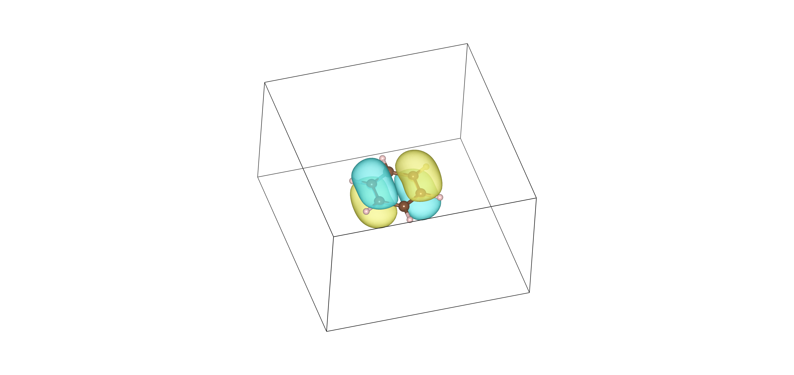
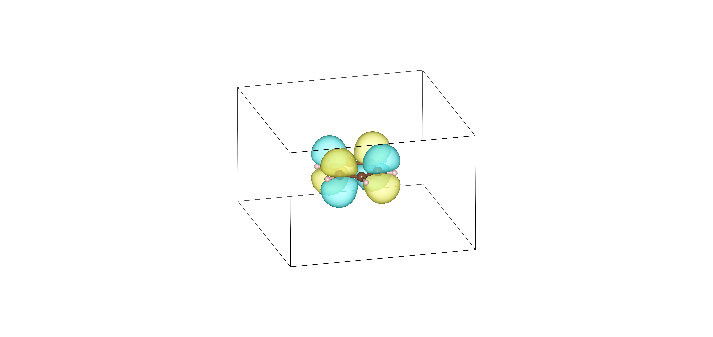

# 16. Generating Gaussian Cube Files for Molecular-Orbital Plots with ORCA 6.1.1

Molecular orbitals are commonly visualized as three-dimensional isosurfaces. ORCA can write the values of a selected molecular orbital on a regular Cartesian grid in Gaussian cube format.

A cube file contains:

- the molecular geometry;
- the dimensions and spacing of a three-dimensional grid;
- the value of the selected orbital at every grid point.

The resulting `.cube` files can be visualized using programs such as:

- Vesta;
- VMD;
- Avogadro;
- ChimeraX;
- Jmol;
- Multiwfn;
- GaussView.

In this example, the HOMO and LUMO of benzene are calculated using LC-BLYP/def2-TZVP and written as `HOMO.cube` and `LUMO.cube`.

---

## 16.1 Geometry of benzene

The molecular geometry is stored in `geom.xyz`.

```text
12
test
C 0.0000 1.3970 0.0000
C 1.2098 0.6985 0.0000
C 1.2098 -0.6985 0.0000
C 0.0000 -1.3970 0.0000
C -1.2098 -0.6985 0.0000
C -1.2098 0.6985 0.0000
H 0.0000 2.4810 0.0000
H 2.1486 1.2405 0.0000
H 2.1486 -1.2405 0.0000
H 0.0000 -2.4810 0.0000
H -2.1486 -1.2405 0.0000
H -2.1486 1.2405 0.0000
```

The benzene molecule lies in the \(xy\)-plane, while the \(z\)-axis is perpendicular to the molecular plane.

This orientation is convenient for interpreting the benzene \(\pi\) orbitals, which have lobes above and below the molecular plane.

---

## 16.2 ORCA input for generating HOMO and LUMO cube files

```text
! LC-BLYP RIJCOSX def2-TZVP def2/J TightSCF XYZFILE

* xyzfile 0 1 geom.xyz

%MaxCore 64000

%scf
  Convergence VeryTight
  MaxIter 300
end

%pal
  nprocs 14
end

%plots
  dim1 90
  dim2 90
  dim3 90

  Format Gaussian_Cube

  MO("HOMO.cube",20,0);
  MO("LUMO.cube",21,0);
end
```

The calculation is a single-point LC-BLYP/def2-TZVP calculation. After the SCF calculation converges, ORCA evaluates the selected molecular orbitals on a three-dimensional grid and writes them in Gaussian cube format.

---

## 16.3 Meaning of the `%plots` block

```text
%plots
  dim1 90
  dim2 90
  dim3 90

  Format Gaussian_Cube

  MO("HOMO.cube",20,0);
  MO("LUMO.cube",21,0);
end
```

### Grid dimensions

```text
dim1 90
dim2 90
dim3 90
```

These keywords define the number of grid points along the three Cartesian directions.

The present grid contains

$$
90\times90\times90=729000
$$

grid points for each orbital.

Increasing the grid dimensions produces a smoother orbital surface but also increases:

- the cube-file size;
- the time required to generate the file;
- the memory required by the visualization program.

For routine visualization, grid dimensions between approximately 70 and 120 are usually sufficient.

---

### Cube-file format

```text
Format Gaussian_Cube
```

This instructs ORCA to write the orbital values in Gaussian cube format.

The files generated in this calculation are:

```text
HOMO.cube
LUMO.cube
```

---

### Selecting the molecular orbital

The general syntax is

```text
MO("filename.cube", orbital_number, spin_set);
```

For example,

```text
MO("HOMO.cube",20,0);
```

requests molecular orbital 20 and writes it to `HOMO.cube`.

Similarly,

```text
MO("LUMO.cube",21,0);
```

requests molecular orbital 21 and writes it to `LUMO.cube`.

For the present closed-shell benzene calculation:

| Orbital | ORCA orbital number |
|---|---:|
| HOMO | 20 |
| LUMO | 21 |

The orbital numbering should always be checked in the `ORBITAL ENERGIES` section of the ORCA output.

Do not assume that the HOMO and LUMO will always have the same orbital numbers. The orbital indices depend on:

- the number of electrons;
- molecular charge;
- spin multiplicity;
- molecular composition;
- whether core orbitals are included.

The third entry, `0`, selects the orbital set used for the present restricted closed-shell calculation.

---

## 16.4 Identifying the HOMO and LUMO from the ORCA output

The ORCA output contains a section similar to:

```text
----------------
ORBITAL ENERGIES
----------------

  NO   OCC          E(Eh)            E(eV)
 ...
  20  2.0000        ...              ...
  21  0.0000        ...              ...
```

The highest orbital with nonzero occupancy is the HOMO.

The next orbital is the LUMO.

For a closed-shell molecule:

- occupied spatial orbitals normally have occupancy `2.0000`;
- unoccupied orbitals have occupancy `0.0000`.

Thus, if orbital 20 is the last orbital with occupancy 2 and orbital 21 is the first orbital with occupancy 0,

$$
\mathrm{HOMO}=20
$$

and

$$
\mathrm{LUMO}=21.
$$

These numbers can then be inserted into the `%plots` block.

---

## 16.5 Interpretation of the cube-file values

A molecular orbital may have positive and negative values:

$$
\psi_i(\mathbf r)>0
$$

or

$$
\psi_i(\mathbf r)<0.
$$

Visualization programs usually display the two signs using two different colors.

The colors do not represent positive and negative electric charge. They represent the phase or sign of the molecular-orbital wavefunction.

The absolute sign of an orbital is arbitrary. Multiplying the entire orbital by \(-1\),

$$
\psi_i(\mathbf r)\rightarrow-\psi_i(\mathbf r),
$$

does not change any physical observable.

What is chemically important is the relative phase between neighboring orbital lobes.

---

## 16.6 Orbital nodes

A nodal surface is a region where

$$
\psi_i(\mathbf r)=0.
$$

The sign of the orbital changes when a nodal surface is crossed.

For the benzene \(\pi\) orbitals, the molecular plane is a nodal plane because the contributing carbon \(p_z\) orbitals have opposite signs above and below the ring plane.

Additional nodes may pass through:

- carbon atoms;
- C–C bonds;
- the center of the ring.

The number and location of the nodes help distinguish different occupied and virtual \(\pi\) orbitals.

---

## 16.7 HOMO and LUMO of benzene

Benzene has six \(p_z\) atomic orbitals that combine to form six \(\pi\) molecular orbitals:

- three occupied \(\pi\) orbitals;
- three unoccupied \(\pi^\ast\) orbitals.

The HOMO belongs to the highest occupied part of the benzene \(\pi\) system, while the LUMO belongs to the lowest unoccupied \(\pi^\ast\) set.

In ideal benzene, the HOMO and LUMO levels are each degenerate. Therefore, a complete visualization should generally include both members of the HOMO pair and both members of the LUMO pair.

For example, after checking the orbital indices in the output, one may request:

```text
%plots
  dim1 90
  dim2 90
  dim3 90

  Format Gaussian_Cube

  MO("HOMO-1.cube",19,0);
  MO("HOMO.cube",20,0);
  MO("LUMO.cube",21,0);
  MO("LUMO+1.cube",22,0);
end
```

The exact numbering must be confirmed from the ORCA output.

Because degenerate orbitals may be rotated into different but equivalent linear combinations, the individual shapes of the two orbitals can depend on:

- molecular orientation;
- numerical details of the calculation;
- symmetry treatment;
- mixing within the degenerate orbital subspace.

The total degenerate orbital space is physically meaningful even when the appearance of each individual orbital changes.

### 16.7.1 HOMO and LUMO plots

The two colors represent opposite phases of the orbital wavefunction.

<table>
<tr>
<td align="center">
<br>
<b>HOMO</b>
</td>
<td align="center">
<br>
<b>LUMO</b>
</td>
</tr>
</table>

**Figure 16.1:** HOMO and LUMO isosurfaces of benzene calculated at the LC-BLYP/def2-TZVP level. The cube files were generated with ORCA 6.1.1 and visualized using VESTA with the same isosurface value. The two colors indicate opposite phases (signs) of the molecular orbital.
---

## 16.8 Choice of isosurface value

A cube file stores the orbital value throughout the grid. The visualization program then draws surfaces satisfying

$$
\psi_i(\mathbf r)=+\psi_{\mathrm{iso}}
$$

and

$$
\psi_i(\mathbf r)=-\psi_{\mathrm{iso}}.
$$

Typical orbital isosurface values are approximately:

```text
0.02
0.03
0.04
0.05
```

A small isovalue produces a larger and more diffuse surface.

A large isovalue displays only regions where the orbital amplitude is large.

When comparing several orbitals, the same absolute isovalue should be used for all plots.

---

## 16.9 Visualizing the cube files in VMD

The cube file may be loaded into VMD using:

```text
File -> New Molecule -> Browse -> HOMO.cube
```

After loading the file:

1. Open `Graphics -> Representations`.
2. Select `Drawing Method -> Isosurface`.
3. Choose the volumetric data set.
4. Set a positive isovalue, for example `0.03`.
5. Create a second representation with isovalue `-0.03`.
6. Use different colors for the positive and negative phases.

The two surfaces represent the two phases of the orbital.

---

## 16.10 Generating additional orbital cube files

Additional occupied and virtual orbitals can be requested by adding more `MO` lines.

For example:

```text
%plots
  dim1 90
  dim2 90
  dim3 90

  Format Gaussian_Cube

  MO("HOMO-2.cube",18,0);
  MO("HOMO-1.cube",19,0);
  MO("HOMO.cube",20,0);
  MO("LUMO.cube",21,0);
  MO("LUMO+1.cube",22,0);
  MO("LUMO+2.cube",23,0);
end
```

This generates six cube files spanning the frontier-orbital region.

---

## 16.11 Cube files for electron density and related quantities

The `%plots` block can also be used to generate scalar fields other than individual molecular orbitals, depending on the options supported by the ORCA version.

Examples include:

- total electron density;
- spin density;
- electrostatic potential;
- orbital densities.

An individual molecular-orbital cube stores

$$
\psi_i(\mathbf r),
$$

whereas an orbital-density cube would store

$$
|\psi_i(\mathbf r)|^2.
$$

These are different quantities.

The molecular orbital has positive and negative phases, while the orbital density is non-negative everywhere:

$$
|\psi_i(\mathbf r)|^2\geq0.
$$

For examining nodes and orbital interactions, the signed molecular orbital \(\psi_i(\mathbf r)\) is generally more informative.

---

## 16.12 Cube-file size and grid quality

A larger grid produces a more detailed representation, but the quality also depends on the physical extent of the plotting box.

Before interpreting the result, check that:

- the molecule lies entirely inside the cube;
- none of the orbital lobes are cut off at the edges;
- the grid is sufficiently fine to produce smooth surfaces;
- the same grid and isovalue are used when comparing related orbitals.

For large molecules, `90 × 90 × 90` may be adequate for qualitative plots, but a larger grid may be required for publication-quality images or quantitative real-space analysis.

---

## 16.13 Important distinction between canonical MOs and NBOs

The orbitals generated in this section are the canonical molecular orbitals obtained directly from the ORCA SCF calculation.

They are not the localized Natural Bond Orbitals discussed in Section 15.

Canonical molecular orbitals satisfy the Fock eigenvalue equation:

$$
\hat F\phi_i=\varepsilon_i\phi_i.
$$

They are often delocalized over the molecule and are particularly useful for discussing:

- frontier orbital shapes;
- HOMO–LUMO interactions;
- electronic excitations;
- orbital symmetry;
- nodal patterns.

NBOs are obtained by transforming the occupied and virtual orbital spaces into localized orbitals resembling:

- bonds;
- lone pairs;
- antibonds;
- Rydberg orbitals.

Thus,

$$
\text{canonical HOMO/LUMO}
\neq
\text{bonding/antibonding NBOs}
$$

in general.

---

## 16.14 Summary

The essential `%plots` input for generating HOMO and LUMO cube files is:

```text
%plots
  dim1 90
  dim2 90
  dim3 90

  Format Gaussian_Cube

  MO("HOMO.cube",20,0);
  MO("LUMO.cube",21,0);
end
```

The main points are:

1. The orbital numbers must be taken from the ORCA `ORBITAL ENERGIES` section.
2. The highest occupied orbital is the HOMO.
3. The first unoccupied orbital is the LUMO.
4. The grid dimensions determine the spatial resolution of the cube file.
5. Positive and negative orbital lobes represent opposite phases, not opposite charges.
6. The orbital is zero at a nodal surface.
7. The same isovalue should be used when comparing orbitals.
8. Degenerate orbitals should normally be plotted together.
9. Canonical MO cube files are different from localized NBO orbital files.
10. Cube files can be visualized using VMD, Avogadro, ChimeraX, Jmol, Multiwfn, or similar programs.
